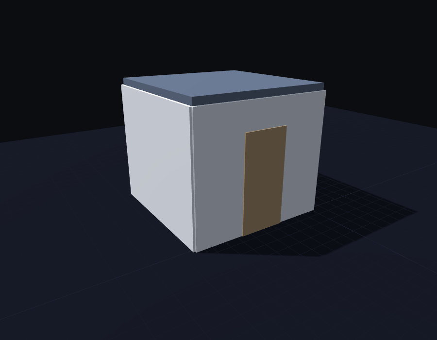

# BIMforge

Interactive Revit/BIM training platform — Duolingo-style lessons for construction professionals.

**[Try it live →](https://bimforgedotnet.github.io/BIMforge/)**

## What is this?

A single-file HTML prototype that teaches BIM fundamentals through hands-on 3D exercises. Users build a room step-by-step — placing walls, doors, a roof, and windows — with real-time feedback and geometry-based scoring.

Built to demonstrate interactive BIM training to construction companies.

## Chapter 1 — First Room

| Lesson | Task | Interaction |
|--------|------|-------------|
| 1 | Place first wall | Two-click placement along X-axis |
| 2 | Place second wall | Two-click placement along Z-axis |
| 3 | Complete the room | Place 2 closing walls (any order) |
| 4 | Door & roof | Wall-hosted door + 4-click roof sketch |
| 5 | Final Challenge | Build the full room from scratch, no guides — 80%+ to pass |

## Chapter 2 — Windows & Openings

Unlocks after Chapter 1 is complete. The room from Chapter 1 (4 walls, door, roof) is pre-built so lessons can focus purely on window placement.

| Lesson | Task | Interaction |
|--------|------|-------------|
| 1 | Place first window | Hover any wall, click to place — familiarisation |
| 2 | Window at offset | Right wall, 600mm from the corner |
| 3 | Precise position | Top wall, 900mm from the left corner — no floor plan |
| 4 | Match floor plan | Left wall, 1500mm from corner, using a reference SVG |
| 5 | Assessment | Full room from scratch + 2 windows — 80%+ to pass |

## Features

- **3D viewport** with orbit, pan, and zoom controls
- **300mm grid snapping** with endpoint snap assist
- **Wall corner joining** — perpendicular walls connect cleanly
- **Wall-hosted doors & windows** — snap to the nearest wall face with a live ghost preview
- **Roof sketching** — 4-click boundary with corner guides, snaps to wall-top corners
- **Geometry-based scoring** — length accuracy, endpoint position, axis alignment, wall-to-target optimal matching
- **Educational feedback** — tips explain what went wrong and how to fix it
- **Live measurements** — length, angle, and coordinates shown during placement
- **Lesson locking & retry** — each lesson locks once scored; "Clear Current Placement" resets it cleanly for another attempt
- **Progress persistence** — chapter/lesson completion saved to `localStorage` and restored on reload
- **Chapter complete screen** — rotating 3D preview of the finished room, XP and per-lesson score breakdown
- **Dark professional UI** with orange (#F5620F) accent

## Quick Start

Open `index.html` in any modern browser. No build step, no dependencies to install — everything (Three.js, Tailwind CSS, Font Awesome, fonts) loads from CDN.

## Tech Stack

- **Three.js r128** — 3D rendering, raycasting, shadow mapping
- **Tailwind CSS** (CDN) — utility-first styling
- **Font Awesome 6.5** — icons
- **Space Grotesk + Inter** — typography

See [CLAUDE.md](CLAUDE.md) for architecture notes, [CURRICULUM.md](CURRICULUM.md) for the full lesson curriculum, and [CHANGELOG.md](CHANGELOG.md) for a log of bug fixes and behavioural changes.

## License

[MIT](LICENSE)
